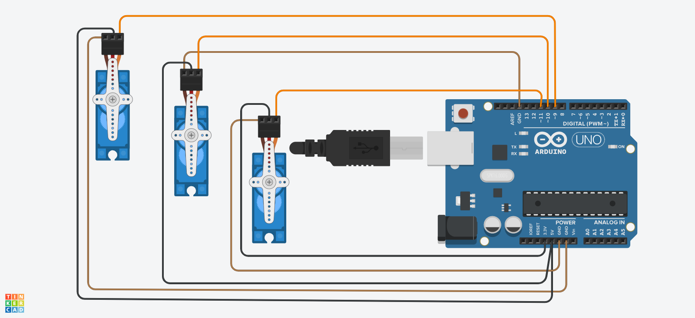

# 🤖 TriServo Synchronization Control System

## 📋 Project Overview
The TriServo Synchronization Control System is an educational Arduino-based project that demonstrates how to control multiple servo motors in a synchronized and coordinated manner. This project serves as an excellent foundation for learning robotics and motor control, and can be further developed for more complex applications such as robotic arms or automation systems.

## 🎯 Project Goal

Learn the fundamentals of controlling multiple servo motors and understand the concepts of synchronized programming and precise motion control.

## 🚀 Demo

*Three servo motors working in perfect synchronization*

### 🎬 Live Demo Features:
- **Synchronized Movement**: All three servos move in perfect harmony
- **Precise Positioning**: Accurate movement from 0° to 180° and back
- **Smooth Operation**: Gradual movement with 15ms delays for stability
- **Continuous Cycle**: Automated loop for demonstration purposes
